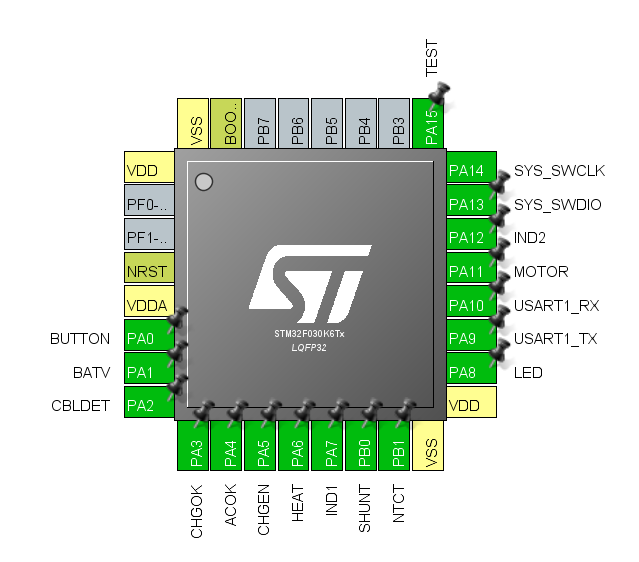

# Pinnacle
Open Source custom firmware replacement for the Puffco® Peak vaporizer.

The stock firmware of the device has several limitations, the most obvious of which are non-configurable Temperature Settings.

With the huge third-party accessory market manufacturing replacement buckets from Quartz, Silicon Carbide and other materials the limitations of the 4 built-in temperature modes are immediately apparent.

The goal of this project is to produce an Open Source replacement firmware for the device which first establishes feature parity with the Original Firmware, followed by integrating new features requested by the community such as user-configurable Temperature Setpoints and LED Control.

## Currently Implemented:
- Vibration Motor Control
- Power Button Control
- LED Control
- NTC Thermistor (Battery Temperature)
- UART Serial Port Output

## To Do:
- Battery Voltage Detection
- Battery Charge Detection
- Heat Output / PWM Control
- Atomizer Resistance / Temperature Monitor
- General Program Flow

## Planned Features:
- nRF51822 BLE Module via On-Board Serial Port

## Programming Hardware:
The manufacturer has made it quite easy to start hacking on the device, and it does not require you to take apart your device to download or upload code.

The "Micro USB" port on the back of the unit provides a charging port for the battery, but does not actually expose a USB interface.

With a little bit of knowledge of the board layout and typical STM32F configurations, we were able to determine the D+ and D- lines on the Micro-USB port are actually a SWD (Serial Wire Debug) interface to the processor.

To make the custom programming cable, you will need the following items:

- ST-Link V2 (Can be found on eBay for about $5 USD)
- Micro-USB Cable

You will need to cut the Micro-USB cable and strip the wires to attach them to the ST-Link. We recommend attaching Dupont pin headers.

If you have more patience than I do, you can order a "Micro USB to dupont" cable on ebay and wait for the slow shipping.

- STLink 5v -> USB Red Wire
- STLink GND -> USB Black Wire
- STLink SWD IO -> USB Green Wire
- STLink SWD CLK -> USB White Wire


## Development Toolchain Setup
This document assumes you are running on Mac OS or Linux, if you need to setup on Windows, feel free to submit contributions to this document.

You will need a Python3 environment and to pip install pyusb or libusb. We also assume you have a basic environment setup with the normal tools: homebrew, git, etc.

If you wish to do normal debugging and set breakpoints, etc. This document will assume you have VSCode installed.

Make sure your device is connected to the ST-Link with the custom USB to SWD Cable.

### Backup OFW (Original Firmware)
You should take a dump of your original, unmodified device firmware before you go any further and keep it in a safe place.

- Verify MCU Connectivity

`pystlink -i` should return output similar to this:

```
DEVICE: ST-Link/V2 V2J33S7
SUPPLY: 3.24V
CORE:   CortexM0
MCU:    STM32F030x6/STM32F031x6/STM32F038x6
FLASH:  32KB
SRAM:   4KB-->
```

Pull down a copy of [PySTLink](https://github.com/pavelrevak/pystlink.git).

- Backup Device Flash: `pystlink read:flash:flash.bin`

- Backup Device SRAM: `pystlink read:sram:sram.bin`

If you ever wish to return your device to its original factory state, you will need to reflash this file back to the device and we cannot help you if you lose it.

### Compiler

You can install GCC for ARM, an STLink utility and a GDB debugger with these Homebrew commands

`brew tap nitsky/stm32`

`brew install arm-none-eabi-gcc`

`brew install --HEAD stlink`

### Debugging

If you wan't to open your device and wire up a TTL to Serial converter, you can send printf statements to the serial port.

But since we already have an STLink connection and we plan to use the serial port for the Bluetooth module / some people might not want to open their device, we can setup the real debugger.

- Section In Progress

### Flashing Firmware

You can erase and reprogram the STM32F Flash with a single command.

`pystlink flash:erase flash:file_to_flash.bin`

You will see output such as:

```
DEVICE: ST-Link/V2 V2J33S7
SUPPLY: 3.24V
CORE:   CortexM0
MCU:    STM32F030x6/STM32F031x6/STM32F038x6
FLASH:  32KB
SRAM:   4KB
Erasing FLASH: [========================================] done in 0.10s
Loaded 32768 Bytes from file_to_flash.bin file
Writing FLASH: [========================================] done in 1.57s
```

## MCU and Pinout:
The device is controlled by a ST Microelectronics STM32F030 Microprocessor

This graphic will be updated as development on the Custom Firmware progresses and the remaining pins functionality is confirmed and implemented.




### Disclaimer:
The firmware is distributed in the hope that it will be useful, but without any warranty. It is provided "as is" without warranty of any kind, either expressed or implied, including, but not limited to, the implied warranties of merchantability and fitness for a particular purpose. The entire risk as to the quality and performance of the firmware is with you.

All product and company names are trademarks™ or registered® trademarks of their respective holders. Use of them does not imply any affiliation with or endorsement by them.
